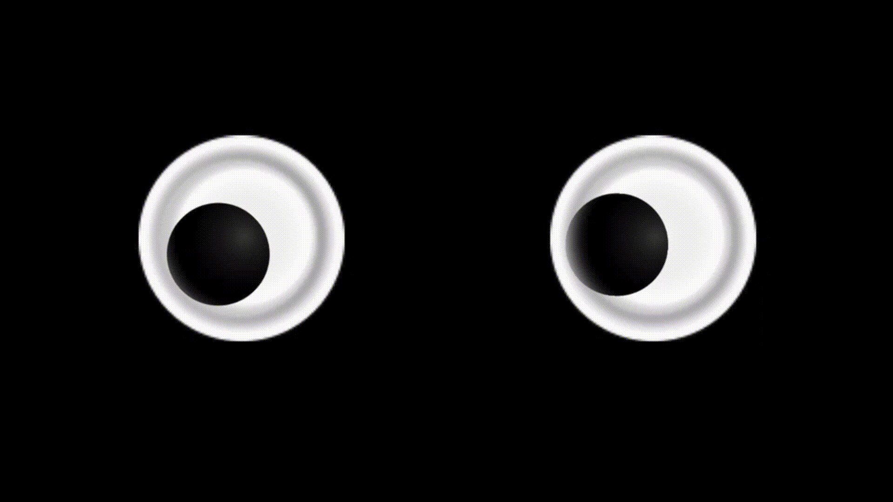

# googlyeyes

[](https://travis-ci.org/Michael Mork/googlyeyes)
[](http://cocoapods.org/pods/googlyeyes)
[](http://cocoapods.org/pods/googlyeyes)
[](http://cocoapods.org/pods/googlyeyes)



## A Classic

Combine Apple's UIKitDynamics and CoreMotion frameworks to bring this classic anthropomorphic motif to life on iOS

## Usage

#### Initialize

##### CGRect

    let leftEye = GooglyEye(frame: CGRect(x: 30, y: 300, width: 100, height: 100))

##### Autolayout
##### Remember to set a constraint for the width or height 

    let rightEye = GooglyEye.autolayout()
    

#### Configure

Make adjustments to the pupil width as a percentage of its respective sclera's diameter.

    leftEye.pupilDiameterPercentageWidth = 0.1

## Example

To run the example project, clone this repo and run `pod install` from the Example directory first.

## Requirements

iOS 12.0

## Installation

googlyeyes is available through [CocoaPods](http://cocoapods.org). To install
it, simply add the following line to your Podfile:

```
pod "googlyeyes"
```

## License

googlyeyes is available under the MIT license. See the LICENSE file for more info.
